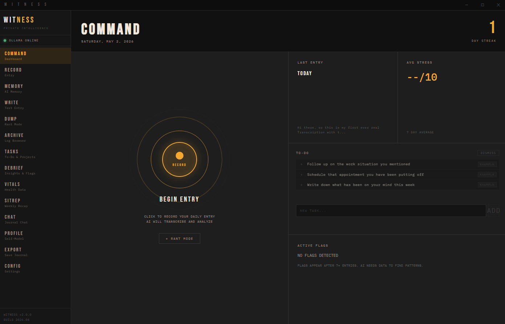
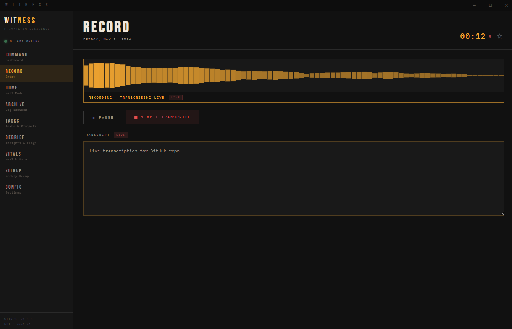

<p align="center">
  
</p>

# WITNESS
### Private AI journal. Runs entirely on your machine.

Witness records your voice, transcribes it locally, and uses a local AI to track your mood, stress, energy, and behavioral patterns over time. Nothing leaves your computer. No subscriptions. No cloud.




---

## What It Does

- **Voice journal** — speak your entry, Witness transcribes it in real time
- **AI analysis** — extracts mood, stress, energy, anxiety, and clarity scores from what you say
- **Behavioral flags** — surfaces honest patterns it notices across your entries
- **Health correlation** — import Apple Health data and overlay HRV, sleep, and resting heart rate against your journal metrics on a dual-axis chart. The AI reads 30 days of paired data and writes a plain-English pattern summary — specific observations, no wellness-chatbot language
- **Weekly recap** — AI-generated summary of the week with pattern observations
- **Semantic search** — find past entries by meaning, not just keywords

---

## Who Built This

I'm a high school student. I built Witness for myself because I wanted a journaling tool that was actually private and didn't try to sell me a subscription. I used Claude (Anthropic's AI) to help write most of the code. I designed it, tested it, broke it, fixed it, and use it daily on my own machine.

This is not a startup. There's no team. Bug fixes will happen when I have time, which is not always. If something breaks and you know how to fix it, pull requests are welcome. If you open an issue I'll look at it but I can't promise a turnaround.

The code is all here. Read it if you want.

---

## Requirements

### 1. Ollama
Ollama runs the AI model locally. Witness will try to launch it automatically.

If you need to install it manually, go to **https://ollama.com/download** and run the Windows installer.

You do not need to pull a model before launching. Witness walks you through picking and downloading one from the CONFIG screen on first launch.

### 2. Hardware
- **OS:** Windows 10 or 11 (64-bit)
- **RAM:** 8GB minimum (runs the default gemma4:3b model)
- **RAM:** 16GB+ if you want deepseek-r1:14b, which gives noticeably better insights
- **Storage:** 5-15GB free depending on which model you pick

A GPU helps with speed but is not required. Everything runs on CPU.

---

## Installation

1. Download **Witness Setup 1.0.0.exe** from the [Releases](../../releases) page
2. Run it. Windows will probably show a blue "Windows protected your PC" warning
   - This happens because the app isn't commercially code-signed (that costs $hundreds/year)
   - Click **"More info"** then **"Run anyway"**
   - The full source code is sitting right here in this repo if you want to verify nothing sketchy is happening
3. Follow the installer
4. Launch Witness from the Start Menu or Desktop shortcut

First launch takes 30-60 seconds while the AI model loads. Normal.

---

## First Launch Checklist

- [ ] Ollama is installed
- [ ] You picked and downloaded a model from the CONFIG screen
- [ ] You have at least 8GB RAM
- [ ] The sidebar shows "OLLAMA ONLINE" after about 60 seconds

If the sidebar shows "OLLAMA OFFLINE" after a full minute, see Troubleshooting.

---

## Using the Health Correlation Feature

1. On your iPhone: **Health → your profile photo → Export All Health Data**
2. Transfer the `.zip` to your PC, unzip it
3. In Witness, go to **VITALS → + IMPORT** and select the `export.xml` file
4. Once imported, click the **CORRELATION** tab
5. Toggle which journal metrics and health metrics you want to compare
6. Click **RUN ANALYSIS** to get an AI-written pattern summary

The chart shows journal scores (stress, mood, energy, anxiety) on the left axis and health data (HRV, sleep, resting heart rate) on the right axis. Lines only appear on days where both a journal entry and health data exist for the same date — you need some overlap before the chart populates.

The AI analysis requires at least 7 days of overlapping data. It takes 30-60 seconds on deepseek-r1:14b. That's normal.

---

## Where Your Data Lives

```
C:\Users\<YourName>\AppData\Roaming\Witness\witness.db
```

Your journal is a single SQLite file at that path. It survives updates and reinstalls. Uninstalling Witness does not touch it. If you want a backup, copy that file somewhere.

---

## Privacy

Your data goes nowhere. Physically cannot.

I'm a high school student running a gaming PC in my room. There's no server on the other end, no company collecting anything, and no reason I'd want your journal entries even if I could get them. Witness talks to `localhost` only. The one exception: on your very first recording, Witness downloads the Whisper transcription model (about 150MB) from the internet. After that, everything runs offline permanently.

No analytics. No telemetry. No account. No cloud. The database file is yours.

---

## Troubleshooting

**"OLLAMA OFFLINE" in the sidebar**
- Open a terminal and run `ollama serve` to start it manually
- Make sure you downloaded a model from the CONFIG screen
- Restart the app

**Blue SmartScreen warning on install**
- Expected. Click "More info" then "Run anyway". Source code is all here.

**App is slow / AI takes forever**
- gemma4:3b (the default) runs fine on most machines
- For faster responses on older hardware, try llama3.2:3b in CONFIG
- For better insight quality, upgrade to deepseek-r1:14b if you have 16GB+ RAM

**Microphone not working**
- Windows Settings > Privacy > Microphone — make sure Witness has access
- Check that no other app has exclusive hold on the mic

**Transcription fails on first recording**
- Witness is downloading the Whisper model (~150MB) — needs internet this one time
- Wait for it to finish, then try again

**Correlation chart shows "NO PAIRED DATA"**
- You need journal entries and Apple Health data on the same dates
- Import your Apple Health export first, then check whether your journal entries overlap with those dates
- Try a wider date range (60 days instead of 30)

**Correlation AI analysis button is greyed out**
- Need at least 7 days of overlapping data before the AI can find patterns
- Record more entries or import a longer Apple Health export

---

## Changing the AI Model

Witness defaults to `gemma4:3b`. From CONFIG you can browse and download other models. Witness shows which ones fit your hardware.

| Model | Size | RAM Needed | Notes |
|---|---|---|---|
| gemma4:3b | 3GB | 8GB | Default. Good for most machines |
| llama3.2:3b | 2GB | 8GB | Faster, slightly less nuanced |
| deepseek-r1:14b | 9GB | 16GB | Best quality. What I run |
| deepseek-r1:32b | 20GB | 32GB | Maximum. Needs serious hardware |

---

## Running From Source

If you want to run the code directly instead of using the installer:

**You need:** Node.js 20+, Python 3.11 or 3.12, Ollama

```
git clone https://github.com/SpaseCases/Witness.git
cd Witness
npm install
cd python-backend
pip install -r requirements.txt
cd ..
npm run dev
```

---

## Tech Stack

| Layer | Technology |
|---|---|
| Desktop shell | Electron |
| UI | React + Vite |
| AI backend | Python + FastAPI |
| Local LLM | Ollama (any model) |
| Transcription | Faster-Whisper (local) |
| Journal storage | SQLite |
| Semantic search | ChromaDB |
| Animations | GSAP |

---

## Roadmap

Things I want to add. No timeline, no promises.

- **Mac support** — .dmg installer so Witness runs on MacOS
- **iPhone companion app** — record entries from your phone over local WiFi, syncs to the desktop, no cloud involved
- **Deeper health correlations** — the dual-axis chart and AI analysis are live. Next is automatic pattern detection across longer windows without needing to manually trigger it
- **Export** — get your full journal out as PDF or plain text

Pull requests are open if you want to build any of these.

---

## License

MIT. See LICENSE.
